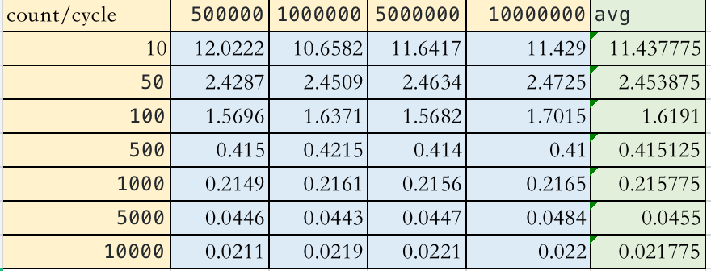
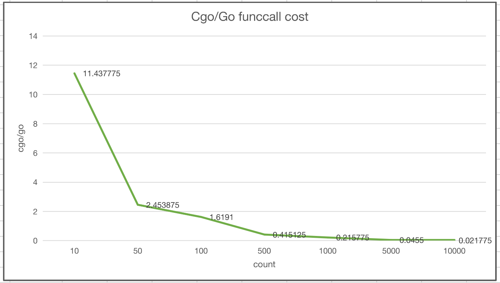

# cgo-bench

```
// go run main.go
count: 10, cycle: 500000, cgo: 34.420728ms, go: 2.8631ms, cgo/cycle: 68ns, go/cycle: 5ns cgo/go: 12.0222
count: 10, cycle: 1000000, cgo: 54.821951ms, go: 5.143633ms, cgo/cycle: 54ns, go/cycle: 5ns cgo/go: 10.6582
count: 10, cycle: 5000000, cgo: 276.215279ms, go: 23.72644ms, cgo/cycle: 55ns, go/cycle: 4ns cgo/go: 11.6417
count: 10, cycle: 10000000, cgo: 547.493103ms, go: 47.903742ms, cgo/cycle: 54ns, go/cycle: 4ns cgo/go: 11.4290
count: 50, cycle: 500000, cgo: 27.33682ms, go: 11.255556ms, cgo/cycle: 54ns, go/cycle: 22ns cgo/go: 2.4287
count: 50, cycle: 1000000, cgo: 55.332225ms, go: 22.576177ms, cgo/cycle: 55ns, go/cycle: 22ns cgo/go: 2.4509
count: 50, cycle: 5000000, cgo: 275.125825ms, go: 111.686179ms, cgo/cycle: 55ns, go/cycle: 22ns cgo/go: 2.4634
count: 50, cycle: 10000000, cgo: 548.110691ms, go: 221.686657ms, cgo/cycle: 54ns, go/cycle: 22ns cgo/go: 2.4725
count: 100, cycle: 500000, cgo: 26.850102ms, go: 17.105866ms, cgo/cycle: 53ns, go/cycle: 34ns cgo/go: 1.5696
count: 100, cycle: 1000000, cgo: 55.683324ms, go: 34.013477ms, cgo/cycle: 55ns, go/cycle: 34ns cgo/go: 1.6371
count: 100, cycle: 5000000, cgo: 274.983861ms, go: 175.353445ms, cgo/cycle: 54ns, go/cycle: 35ns cgo/go: 1.5682
count: 100, cycle: 10000000, cgo: 565.807779ms, go: 332.529274ms, cgo/cycle: 56ns, go/cycle: 33ns cgo/go: 1.7015
count: 500, cycle: 500000, cgo: 28.107866ms, go: 67.736173ms, cgo/cycle: 56ns, go/cycle: 135ns cgo/go: 0.4150
count: 500, cycle: 1000000, cgo: 55.675557ms, go: 132.092526ms, cgo/cycle: 55ns, go/cycle: 132ns cgo/go: 0.4215
count: 500, cycle: 5000000, cgo: 274.076029ms, go: 662.014685ms, cgo/cycle: 54ns, go/cycle: 132ns cgo/go: 0.4140
count: 500, cycle: 10000000, cgo: 549.303546ms, go: 1.339623927s, cgo/cycle: 54ns, go/cycle: 133ns cgo/go: 0.4100
count: 1000, cycle: 500000, cgo: 27.844244ms, go: 129.589541ms, cgo/cycle: 55ns, go/cycle: 259ns cgo/go: 0.2149
count: 1000, cycle: 1000000, cgo: 55.454138ms, go: 256.596273ms, cgo/cycle: 55ns, go/cycle: 256ns cgo/go: 0.2161
count: 1000, cycle: 5000000, cgo: 277.258613ms, go: 1.286156417s, cgo/cycle: 55ns, go/cycle: 257ns cgo/go: 0.2156
count: 1000, cycle: 10000000, cgo: 547.58263ms, go: 2.529370786s, cgo/cycle: 54ns, go/cycle: 252ns cgo/go: 0.2165
count: 5000, cycle: 500000, cgo: 27.813485ms, go: 623.126501ms, cgo/cycle: 55ns, go/cycle: 1.246µs cgo/go: 0.0446
count: 5000, cycle: 1000000, cgo: 54.529121ms, go: 1.232225252s, cgo/cycle: 54ns, go/cycle: 1.232µs cgo/go: 0.0443
count: 5000, cycle: 5000000, cgo: 276.45882ms, go: 6.182891022s, cgo/cycle: 55ns, go/cycle: 1.236µs cgo/go: 0.0447
count: 5000, cycle: 10000000, cgo: 610.406629ms, go: 12.620529682s, cgo/cycle: 61ns, go/cycle: 1.262µs cgo/go: 0.0484
count: 10000, cycle: 500000, cgo: 28.357581ms, go: 1.343704285s, cgo/cycle: 56ns, go/cycle: 2.687µs cgo/go: 0.0211
count: 10000, cycle: 1000000, cgo: 58.956701ms, go: 2.688045373s, cgo/cycle: 58ns, go/cycle: 2.688µs cgo/go: 0.0219
count: 10000, cycle: 5000000, cgo: 280.817687ms, go: 12.719011833s, cgo/cycle: 56ns, go/cycle: 2.543µs cgo/go: 0.0221
count: 10000, cycle: 10000000, cgo: 562.932582ms, go: 25.596832236s, cgo/cycle: 56ns, go/cycle: 2.559µs cgo/go: 0.0220
```






use cgo CFLAGS: -O0 

```
count: 10, cycle: 500000, cgo: 40.199092ms, go: 3.561226ms, cgo/cycle: 80ns, go/cycle: 7ns cgo/go: 11.2880
count: 10, cycle: 1000000, cgo: 66.06712ms, go: 6.413268ms, cgo/cycle: 66ns, go/cycle: 6ns cgo/go: 10.3016
count: 10, cycle: 5000000, cgo: 322.066459ms, go: 30.640263ms, cgo/cycle: 64ns, go/cycle: 6ns cgo/go: 10.5112
count: 10, cycle: 10000000, cgo: 645.22392ms, go: 63.552031ms, cgo/cycle: 64ns, go/cycle: 6ns cgo/go: 10.1527
count: 50, cycle: 500000, cgo: 68.085477ms, go: 13.773439ms, cgo/cycle: 136ns, go/cycle: 27ns cgo/go: 4.9432
count: 50, cycle: 1000000, cgo: 138.350627ms, go: 25.877965ms, cgo/cycle: 138ns, go/cycle: 25ns cgo/go: 5.3463
count: 50, cycle: 5000000, cgo: 664.927552ms, go: 129.726605ms, cgo/cycle: 132ns, go/cycle: 25ns cgo/go: 5.1256
count: 50, cycle: 10000000, cgo: 1.317138158s, go: 261.427987ms, cgo/cycle: 131ns, go/cycle: 26ns cgo/go: 5.0382
count: 100, cycle: 500000, cgo: 116.013862ms, go: 28.753251ms, cgo/cycle: 232ns, go/cycle: 57ns cgo/go: 4.0348
count: 100, cycle: 1000000, cgo: 232.620509ms, go: 57.774096ms, cgo/cycle: 232ns, go/cycle: 57ns cgo/go: 4.0264
count: 100, cycle: 5000000, cgo: 1.156579898s, go: 283.295504ms, cgo/cycle: 231ns, go/cycle: 56ns cgo/go: 4.0826
count: 100, cycle: 10000000, cgo: 2.321864757s, go: 570.037834ms, cgo/cycle: 232ns, go/cycle: 57ns cgo/go: 4.0732
count: 500, cycle: 500000, cgo: 478.678483ms, go: 127.253359ms, cgo/cycle: 957ns, go/cycle: 254ns cgo/go: 3.7616
count: 500, cycle: 1000000, cgo: 945.476603ms, go: 256.245585ms, cgo/cycle: 945ns, go/cycle: 256ns cgo/go: 3.6897
count: 500, cycle: 5000000, cgo: 4.773337976s, go: 1.300605175s, cgo/cycle: 954ns, go/cycle: 260ns cgo/go: 3.6701
count: 500, cycle: 10000000, cgo: 9.736911169s, go: 2.645997644s, cgo/cycle: 973ns, go/cycle: 264ns cgo/go: 3.6799
count: 1000, cycle: 500000, cgo: 917.282593ms, go: 251.373004ms, cgo/cycle: 1.834µs, go/cycle: 502ns cgo/go: 3.6491
count: 1000, cycle: 1000000, cgo: 1.86062182s, go: 497.430328ms, cgo/cycle: 1.86µs, go/cycle: 497ns cgo/go: 3.7405
count: 1000, cycle: 5000000, cgo: 9.557567289s, go: 2.554591147s, cgo/cycle: 1.911µs, go/cycle: 510ns cgo/go: 3.7413
count: 1000, cycle: 10000000, cgo: 19.071487053s, go: 5.033741973s, cgo/cycle: 1.907µs, go/cycle: 503ns cgo/go: 3.7887
count: 5000, cycle: 500000, cgo: 4.623827103s, go: 1.348883596s, cgo/cycle: 9.247µs, go/cycle: 2.697µs cgo/go: 3.4279
count: 5000, cycle: 1000000, cgo: 9.695446457s, go: 2.498193881s, cgo/cycle: 9.695µs, go/cycle: 2.498µs cgo/go: 3.8810
count: 5000, cycle: 5000000, cgo: 47.022605939s, go: 12.633238534s, cgo/cycle: 9.404µs, go/cycle: 2.526µs cgo/go: 3.7221
count: 5000, cycle: 10000000, cgo: 1m33.876616053s, go: 25.252839743s, cgo/cycle: 9.387µs, go/cycle: 2.525µs cgo/go: 3.7175
```
